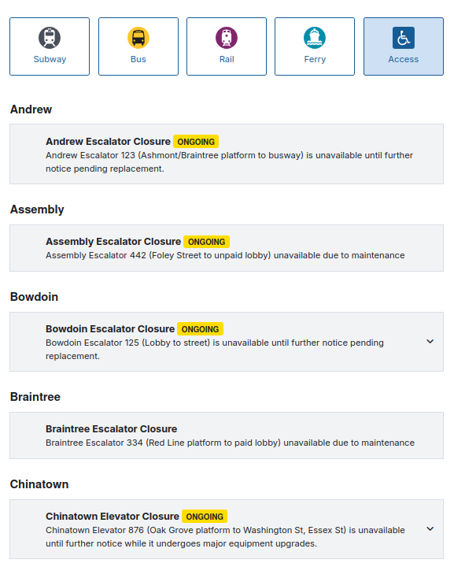
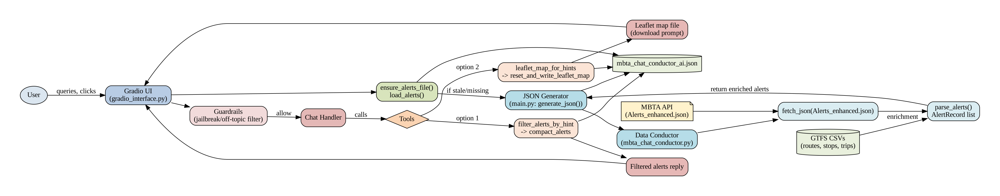
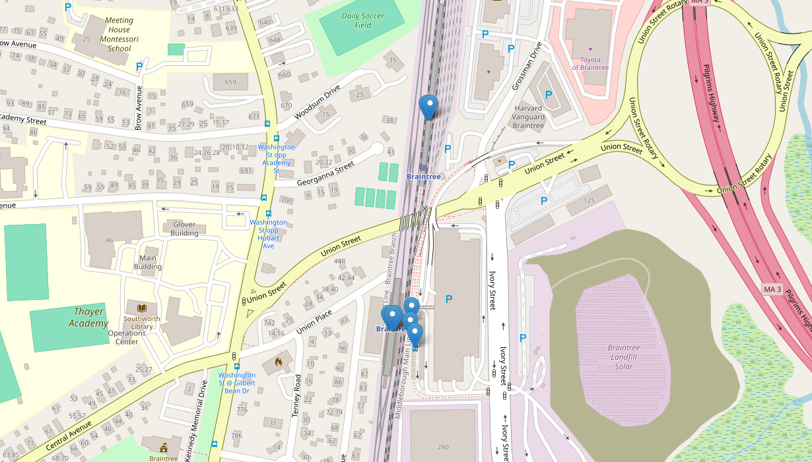
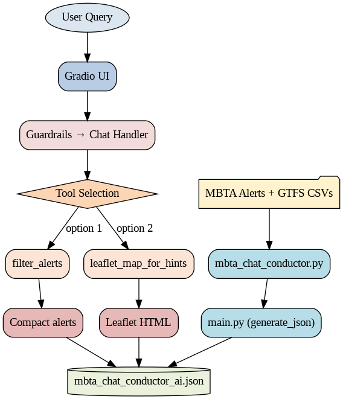
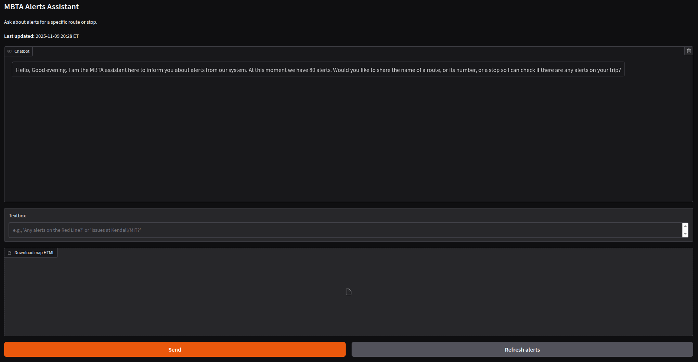
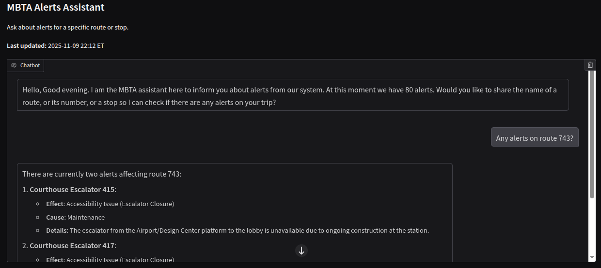
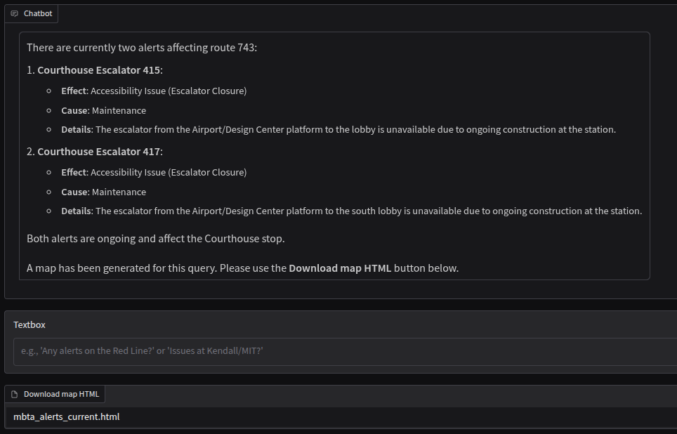
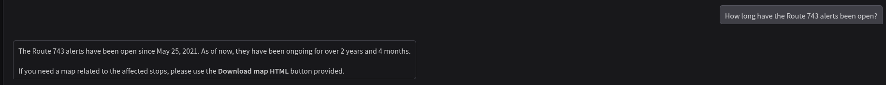
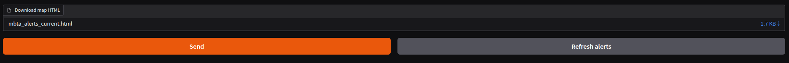

# MBTA AI Assistant

**MBTA AI Assisttant** is an interactive application that allows users to query **Boston MBTA service alerts** through a chat-based interface.  
The system automatically fetches, enriches, and filters live MBTA alert data using GTFS metadata, providing users with contextualized information and geospatial visualizations.

This document relates to the submission of Assignment 2 for the Deploying AI course (DSI). The code was developed by me with assistance from OpenAI's ChatGPT.

---

## Overview

### Motivation

Service alerts are designed to help public transport users obtain information about events and plan their trips. However, these alerts are often presented on websites in long lists, making it difficult to find specific alerts for a particular route, stop, or station (see figure below). While this static format may work well when there are only a few alerts, it becomes impractical during critical situations where multiple alerts are issued at the same time. Additionally, accessibility issues—such as non-functional escalators and elevators—are common. For instance, when I ruptured my Achilles tendon, I had to jump over the stairs because the subway station I wanted to access did not have an accessible route. In this application, I utilize alerts published by the Massachusetts Bay Transportation Authority (MBTA) API and combine them with GTFS, which outlines the transportation infrastructure, to create a more user-friendly response in natural English. This allows users to interact with the service instead of visually searching for alerts. Users can inquire about the locations or routes for which they would like information.

Source: https://www.mbta.com/alerts/access

This app combines **Gradio**, **Python data pipelines**, and **Leaflet maps** to deliver real-time insights on MBTA alerts.  
The architecture ensures that the alert dataset stays up-to-date, guardrails prevent off-topic or unsafe interactions, and each user query produces focused, geolocated results.

---
## How to run it?

`$ python gradio_interface.py`

## System Architecture

The system is composed of three core layers:

### 1. User Interaction Layer
- **File:** `gradio_interface.py`
- **Purpose:** Provides the Gradio UI and manages user queries.
- **Key Components:**
  - **Guardrails:** Filters out non-MBTA or unsafe requests.
  - **Chat Handler:** Directs user queries to the appropriate tool (filter or map).
  - **Timer/Badge:** Displays the freshness of the data (`ensure_alerts_file()`).

**User Flow:**

User → Gradio UI → Guardrails → Chat Handler → Tool Selection

---

### 2. Data Management Layer
- **Files:** `main.py`, `mbta_chat_conductor_ai.json`
- **Purpose:** Ensures data freshness and mediates between the chat layer and the conductor.
- **Key Functions:**
  - `ensure_alerts_file()` → checks if the alerts file exists or is outdated.
  - `generate_json()` → regenerates `mbta_chat_conductor_ai.json` by calling the conductor. The map is updated every 15 minutes during the session.
  - `load_alerts()` → loads alerts into memory for the chat tools.

**Output:**  
A structured JSON file (`mbta_chat_conductor_ai.json`) containing enriched MBTA alerts with fields like:
- `header_text`
- `routes_affected`
- `stops_latlon_affected`
- `effect_name`
- `service_effect_text`

---

### 3. Data Enrichment Layer
- **File:** `mbta_chat_conductor.py`
- **Purpose:** Fetches, enriches, and compiles MBTA alert data from multiple sources.
- **Key Steps:**
  1. **Fetch:** Downloads MBTA’s live `Alerts_enhanced.json` feed. 
  2. **Parse:** Normalizes and parses alerts into structured records (`AlertRecord` objects).
  3. **Enrich:** Adds GTFS metadata (routes, stops, trips, facilities) for contextual accuracy.
  4. **Serialize:** Converts results into a compact JSON file for downstream tools.

**External Dependencies:**
- MBTA API: `https://cdn.mbta.com/realtime/Alerts_enhanced.json`
- GTFS CSVs: local data files used for enrichment (routes, stops, trips, etc.)

---

### 4. Local Filtering + Semantic Fallback

The MBTA Assistant uses a two-stage retrieval pipeline to identify relevant alerts for a user’s question:

- Deterministic Local Filtering (python_filter_alerts)

  - Performs exact or substring matching on structured fields such as routes_affected, route_ids_affected, route_desc_affected, and stops_affected.

  - Activated when the user mentions a specific route number, line name, or stop (e.g., “66”, “Red Line”, “Kendall/MIT”).

  - This ensures fast, explainable matches when the intent is explicit.

- Semantic Fallback (semantic_search_alerts)

  - Triggered when no deterministic match is found.

  - Uses lightweight similarity scoring to find the most relevant alerts, even when the user’s wording doesn’t exactly match the dataset.

## Chat Tools

### 🔹 `filter_alerts_by_hint()`
Filters alerts matching route names, stop names, or service descriptions derived from the user’s query.  
Produces a clean, compact summary of active alerts.

### 🔹 `leaflet_map_for_hints()`
Generates a **Leaflet map (HTML)** centered on affected stops, drawing markers for each location in `stops_latlon_affected`.  
Each new query **resets the map file** before plotting to ensure it reflects only current results.

**Output:**
- `alerts_map.html` → Downloadable from the chat interface.

---

## Data Flow Summary

The following data flow illustrates user interaction via the interface, with the primary outputs being the incidents reported in the MBTA transit network and an HTML file containing the map and markers for the alerts.

## Example

On the home screen, users see a welcome message, the time the alert file was last accessed through the API, and the current number of active alerts.

The user asks "Any alerts on route 743?"

The app offers alerts for route 743 and includes a downloadable HTML map displaying markers for affected locations. The information displayed on the website is not accurate. Specifically, users with mobility restrictions coming from route 743 and accessing via Courthouse Escalator 415 will not be able to reach the connected access point. (I've been through something similar)

We can also track how long the alerts have been open. This information helps users determine whether a problem is recent or recurring. In the example below, the alert has been active for many years. Therefore, it would be advisable for the user to avoid accessing it through the Courthouse Escalator.

In each iteration, the user can display a downloadable map with markers for the related location, or a general map if the question is too broad.

